# Time-Series-Analysis-and-Prediction
Using Deep Learning and RNN/LSTM for Time Series Learning and Prediction

### Problem Description
The task is to predict the number of international airline passengers in units of 1,000. The data ranges from January 1949 to December 1960, or 12 years, with 144 observations.

The dataset is available for free from the DataMarket webpage as a CSV download with the filename "international-airline-passengers.csv".


```python
import pandas
import matplotlib.pyplot as plt

# 1st column of csv file is "date" which we don't need. And 3 footer lines can also be skipped.
dataset = pandas.read_csv('international-airline-passengers.csv', usecols=[1], engine='python', skipfooter=3)

plt.plot(dataset)
plt.show()
```


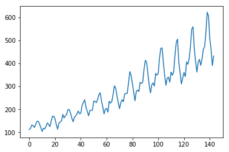


### LSTM Network for Regression

We can phrase the problem as a regression problem.

That is, given the number of passengers (in units of thousands) this month, what is the number of passengers next month?

We can write a simple function to convert our single column of data into a two-column dataset: the first column containing this month's (t) passenger count and the second column containing next month's (t+1) passenger count, to be predicted.

Before we get started, let's first import all of the functions and classes we intend to use. This assumes a working SciPy environment with the Keras deep learning library installed.


```python
import numpy
import matplotlib.pyplot as plt
import pandas
import math
from keras.models import Sequential
from keras.layers import Dense
from keras.layers import LSTM
from sklearn.preprocessing import MinMaxScaler
from sklearn.metrics import mean_squared_error
```

    Using TensorFlow backend.
    

Before we do anything, it is a good idea to fix the random number seed to ensure our results are reproducible.


```python
# fix random seed for reproducibility
seed = numpy.random.seed(7)
```

We can also use the code from the previous section to load the dataset as a Pandas dataframe. We can then extract the NumPy array from the dataframe and convert the integer values to floating point values, which are more suitable for modeling with a neural network.


```python
# load the dataset
filename = 'shampoo-sales.csv'
#filename = 'international-airline-passengers.csv'
skipfooter = 2
dataframe = pandas.read_csv(filename, usecols=[1], engine='python', skipfooter=skipfooter)
dataset = dataframe.values
dataset = dataset.astype('float32')
```

LSTMs are sensitive to the scale of the input data, specifically when the sigmoid (default) or tanh activation functions are used. It can be a good practice to rescale the data to the range of 0-to-1, also called normalizing. We can easily normalize the dataset using the **MinMaxScaler** preprocessing class from the scikit-learn library.


```python
# normalize the dataset
data_range = (-1, 1)
scaler = MinMaxScaler(feature_range=data_range)        # scaler can also de-normalize the dataset by scaler.inverse_transform(), useful for actual prediction
dataset_scaled = scaler.fit_transform(dataset)
#dataset_scaled = numpy.array(dataset_scaled)
```


```python
print(dataset_scaled.shape)
print(len(dataset_scaled))
print(dataset_scaled[0:10])
```

    (36, 1)
    36
    [[-0.47858536]
     [-0.90545583]
     [-0.7732361 ]
     [-0.99999994]
     [-0.78318816]
     [-0.82512879]
     [-0.60014212]
     [-0.62608844]
     [-0.73875952]
     [-0.98720449]]
    

After we model our data and estimate the skill of our model on the training dataset, we need to get an idea of the skill of the model on new unseen data. For a normal classification or regression problem, we would do this using cross validation.

With time series data, the sequence of values is important. A simple method that we can use is to split the ordered dataset into train and test datasets. The code below calculates the index of the split point and separates the data into the training datasets with 67% of the observations that we can use to train our model, leaving the remaining 33% for testing the model.


```python
# split into train and test sets
train_size = int(len(dataset_scaled) * 0.67)
test_size = len(dataset_scaled) - train_size
train, test = dataset_scaled[0:train_size,:], dataset_scaled[train_size:len(dataset),:]
print(len(train), len(test))
```

    24 12
    

Now we can define a function to create a new dataset, as described above.

The function takes two arguments: the **dataset**, which is a NumPy array that we want to convert into a dataset, and the **look_back**, which is the number of previous time steps to use as input variables to predict the next time period in this case defaulted to 1.

This default will create a dataset where X is the number of passengers at a given time (t) and Y is the number of passengers at the next time (t + 1).

It can be configured, and we will by constructing a differently shaped dataset in the next section.


```python
# convert an array of values into a dataset matrix
def create_dataset(data, look_back=1):
    dataX, dataY = [], []
    i_range = len(data) - look_back - 1
    print(i_range)
    for i in range(0, i_range):
        dataX.append(data[i:(i+look_back)])    # index can move down to len(dataset)-1
        dataY.append(data[i + look_back])      # Y is the item that skips look_back number of items
    
    return numpy.array(dataX), numpy.array(dataY)
```


```python
# try it
look_back = 4
dataX, dataY = create_dataset(dataset_scaled, look_back=look_back)
```

    31
    


```python
print("X shape:", dataX.shape)
print("Y shape:", dataY.shape)
   
print("Xt-3     Xt-2      Xt-1      Xt        Y")
print("---------------------------------------------")
for i in range(len(dataX)): 
    print('%.2f   %.2f    %.2f    %.2f    %.2f' % (dataX[i][0][0], dataX[i][1][0], dataX[i][2][0], dataX[i][3][0], dataY[i][0]))
```

    X shape: (31, 4, 1)
    Y shape: (31, 1)
    Xt-3     Xt-2      Xt-1      Xt        Y
    ---------------------------------------------
    -0.48   -0.91    -0.77    -1.00    -0.78
    -0.91   -0.77    -1.00    -0.78    -0.83
    -0.77   -1.00    -0.78    -0.83    -0.60
    -1.00   -0.78    -0.83    -0.60    -0.63
    -0.78   -0.83    -0.60    -0.63    -0.74
    -0.83   -0.60    -0.63    -0.74    -0.99
    -0.60   -0.63    -0.74    -0.99    -0.23
    -0.63   -0.74    -0.99    -0.23    -0.76
    -0.74   -0.99    -0.23    -0.76    -0.73
    -0.99   -0.23    -0.76    -0.73    -0.89
    -0.23   -0.76    -0.73    -0.89    -0.68
    -0.76   -0.73    -0.89    -0.68    -0.45
    -0.73   -0.89    -0.68    -0.45    -0.74
    -0.89   -0.68    -0.45    -0.74    -0.40
    -0.68   -0.45    -0.74    -0.40    -0.62
    -0.45   -0.74    -0.40    -0.62    -0.34
    -0.74   -0.40    -0.62    -0.34    -0.39
    -0.40   -0.62    -0.34    -0.39    0.07
    -0.62   -0.34    -0.39    0.07    -0.48
    -0.34   -0.39    0.07    -0.48    -0.21
    -0.39   0.07    -0.48    -0.21    -0.22
    0.07   -0.48    -0.21    -0.22    0.14
    -0.48   -0.21    -0.22    0.14    -0.30
    -0.21   -0.22    0.14    -0.30    0.14
    -0.22   0.14    -0.30    0.14    0.00
    0.14   -0.30    0.14    0.00    0.13
    -0.30   0.14    0.00    0.13    0.62
    0.14   0.00    0.13    0.62    0.02
    0.00   0.13    0.62    0.02    1.00
    0.13   0.62    0.02    1.00    0.27
    0.62   0.02    1.00    0.27    0.64
    


```python
# Reshape to (samples, timestep, features)
dataX = numpy.reshape(dataX, (dataX.shape[0], 1, dataX.shape[1]))

print("X shape:", dataX.shape)

```

    X shape: (31, 1, 4)
    

Let's use this function to prepare the train and test datasets for modeling.


```python
# reshape into X=t and Y=t+1
look_back = 1
trainX, trainY = create_dataset(train, look_back)      # trainX is input, trainY is expected output
testX, testY = create_dataset(test, look_back)
```

    22
    10
    

The LSTM network expects the input data (X) to be provided with a specific array structure in the form of 3D: **[samples, time steps, features]**, or in other words, 3D tensor with shape **(batch_size, timesteps, input_dim)**, or optionally,  2D tensors with shape  **(batch_size, output_dim)**.

Currently, our data is in the form: [samples, features] and we are framing the problem as one time step for each sample. We can transform the prepared train and test input data into the expected structure using **numpy.reshape()** as follows:


```python
# reshape input to be [samples, time steps, features]
print("Original trainX shape:", trainX.shape)
trainX = numpy.reshape(trainX, (trainX.shape[0], look_back, trainX.shape[1]))     # timestep = 1, input_dim = trainX.shape[1]
testX = numpy.reshape(testX, (testX.shape[0], look_back, testX.shape[1]))
print("New trainX shape:", trainX.shape)
print("trainY shape:", trainY.shape)
print("trainY example:", trainY[0])
```

    Original trainX shape: (22, 1, 1)
    New trainX shape: (22, 1, 1)
    trainY shape: (22, 1)
    trainY example: [-0.90545583]
    

We are now ready to design and fit our LSTM network for this problem.

The network has a visible layer with 1 input, a hidden layer with 4 LSTM blocks or neurons, and an output layer that makes a single value prediction. The default sigmoid activation function is used for the LSTM blocks. The network is trained for 100 epochs and a batch size of 1 is used.

                    output layer ------>         Y
                                                 |
                                               Dense
                                             / |   | \
                                            /  |   |  \
                    Hidden layer (LSTM)    L1->L2->L3->L4
                                           |
                    Input layer  ----->    X


```python
# create and fit the LSTM network
from keras.layers import Dropout

batch_size = 1
timesteps = trainX.shape[1]
input_dim = trainX.shape[2]

model = Sequential()
#model.add(LSTM(8, input_shape=(1, look_back)))    # 4 or 8 is the number of LSTM units or dimensions of output of LSTM layer, can be any integer. input_shape must show up in the first layer
model.add(LSTM(4, batch_input_shape=(batch_size, timesteps, input_dim)))
model.add(Dense(10))    # not necessary, but just want to try it
#model.add(Dropout(0.8))
model.add(Dense(1))
model.compile(loss='mean_squared_error', optimizer='adam')
model.fit(trainX, trainY, epochs=50, batch_size=1, verbose=2)   # it turns out that epochs = 15 is enough, 100 is not necessary
```

    Epoch 1/50
    2s - loss: 0.5243
    Epoch 2/50
    0s - loss: 0.3676
    Epoch 3/50
    0s - loss: 0.2446
    Epoch 4/50
    0s - loss: 0.1668
    Epoch 5/50
    0s - loss: 0.1114
    Epoch 6/50
    0s - loss: 0.0817
    Epoch 7/50
    0s - loss: 0.0706
    Epoch 8/50
    0s - loss: 0.0672
    Epoch 9/50
    0s - loss: 0.0662
    Epoch 10/50
    0s - loss: 0.0647
    Epoch 11/50
    0s - loss: 0.0649
    Epoch 12/50
    0s - loss: 0.0647
    Epoch 13/50
    0s - loss: 0.0653
    Epoch 14/50
    0s - loss: 0.0651
    Epoch 15/50
    0s - loss: 0.0659
    Epoch 16/50
    0s - loss: 0.0647
    Epoch 17/50
    0s - loss: 0.0652
    Epoch 18/50
    0s - loss: 0.0644
    Epoch 19/50
    0s - loss: 0.0646
    Epoch 20/50
    0s - loss: 0.0644
    Epoch 21/50
    0s - loss: 0.0645
    Epoch 22/50
    0s - loss: 0.0645
    Epoch 23/50
    0s - loss: 0.0656
    Epoch 24/50
    0s - loss: 0.0659
    Epoch 25/50
    0s - loss: 0.0642
    Epoch 26/50
    0s - loss: 0.0648
    Epoch 27/50
    0s - loss: 0.0641
    Epoch 28/50
    0s - loss: 0.0640
    Epoch 29/50
    0s - loss: 0.0642
    Epoch 30/50
    0s - loss: 0.0640
    Epoch 31/50
    0s - loss: 0.0640
    Epoch 32/50
    0s - loss: 0.0642
    Epoch 33/50
    0s - loss: 0.0642
    Epoch 34/50
    0s - loss: 0.0644
    Epoch 35/50
    0s - loss: 0.0638
    Epoch 36/50
    0s - loss: 0.0644
    Epoch 37/50
    0s - loss: 0.0642
    Epoch 38/50
    0s - loss: 0.0637
    Epoch 39/50
    0s - loss: 0.0639
    Epoch 40/50
    0s - loss: 0.0637
    Epoch 41/50
    0s - loss: 0.0649
    Epoch 42/50
    0s - loss: 0.0638
    Epoch 43/50
    0s - loss: 0.0635
    Epoch 44/50
    0s - loss: 0.0645
    Epoch 45/50
    0s - loss: 0.0648
    Epoch 46/50
    0s - loss: 0.0635
    Epoch 47/50
    0s - loss: 0.0647
    Epoch 48/50
    0s - loss: 0.0644
    Epoch 49/50
    0s - loss: 0.0638
    Epoch 50/50
    0s - loss: 0.0646
    


    <keras.callbacks.History at 0x101c1860>


Once the model is fit, we can estimate the performance of the model on the train and test datasets. This will give us a point of comparison for new models.

Note that we invert the predictions before calculating error scores to ensure that performance is reported in the same units as the original data (thousands of passengers per month).


```python
# make predictions
trainPredict = model.predict(trainX, batch_size)
testPredict = model.predict(testX, batch_size)      

# invert predictions
trainPredict = scaler.inverse_transform(trainPredict)
trainY = scaler.inverse_transform(trainY)               # trainY is of shape (samples, features) while trainX is of (samples, timesteps, features) )
testPredict = scaler.inverse_transform(testPredict)
testY = scaler.inverse_transform(testY)

print("trainY shape:", trainY.shape)
print("trainPredict shape:", trainPredict.shape)
print("testY shape:", testY.shape)
print("testPredict shape:", testPredict.shape)

# calculate root mean squared error
trainScore = math.sqrt(mean_squared_error(trainY, trainPredict))
print('Train Score: %.2f RMSE' % (trainScore))
testScore = math.sqrt(mean_squared_error(testY, testPredict))
print('Test Score: %.2f RMSE' % (testScore))
```

    trainY shape: (22, 1)
    trainPredict shape: (22, 1)
    testY shape: (10, 1)
    testPredict shape: (10, 1)
    Train Score: 70.67 RMSE
    Test Score: 245.28 RMSE
    

Finally, we can generate predictions using the model for both the train and test dataset to get a visual indication of the skill of the model.

Because of how the dataset was prepared, we must shift the predictions so that they align on the x-axis with the original dataset (because the output Y is 1 timestep shift from input X). Once prepared, the data is plotted, showing the original dataset in blue, the predictions for the training dataset in green, and the predictions on the unseen test dataset in red.


```python
# shift train predictions for plotting
trainPredictPlot = numpy.empty_like(dataset)
trainPredictPlot[:, :] = numpy.nan
#print(trainPredictPlot[0])
trainPredictPlot[look_back:len(trainPredict)+look_back, :] = trainPredict

# shift test predictions for plotting
testPredictPlot = numpy.empty_like(dataset)
testPredictPlot[:, :] = numpy.nan
testPredictPlot[len(trainPredict)+(look_back*2)+1:len(dataset)-1, :] = testPredict

```


```python
# plot baseline and predictions
plt.plot(scaler.inverse_transform(dataset_scaled))
#plt.plot(dataset_scaled)
plt.plot(trainPredictPlot)
plt.plot(testPredictPlot)
plt.show()
```


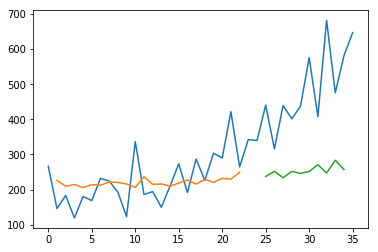


### LSTM for Regression Using the Window Method

We can also phrase the problem so that multiple, recent time steps can be used to make the prediction for the next time step.

This is called a window, and the size of the window is a parameter that can be tuned for each problem.

For example, given the current time (t) we want to predict the value at the next time in the sequence (t+1), we can use the current time (t), as well as the two prior times (t-1 and t-2) as input variables.

When phrased as a regression problem, the input variables are t-2, t-1, t and the output variable is t+1.

The **create_dataset()** function we created in the previous section allows us to create this formulation of the time series problem by increasing the look_back argument from 1 to 3.


```python
# reshape into X=t-2, t-1. t, and Y=t+1
look_back = 4
trainX, trainY = create_dataset(train, look_back)      # trainX is input, trainY is expected output
testX, testY = create_dataset(test, look_back)

# reshape input to be [samples, time steps, features]
print("Original trainX shape:", trainX.shape)
print("Original testX shape:", testX.shape)

trainX = numpy.reshape(trainX, (trainX.shape[0], 1, trainX.shape[1]))    # input_dim = trainX.shape[1] = 4
testX = numpy.reshape(testX, (testX.shape[0], 1, testX.shape[1]))

print("New trainX shape:", trainX.shape)
print("New testX shape:", testX.shape)
print("trainY shape:", trainY.shape)
print("trainY example:", trainY[0])
```

    19
    7
    Original trainX shape: (19, 4, 1)
    Original testX shape: (7, 4, 1)
    New trainX shape: (19, 1, 4)
    New testX shape: (7, 1, 4)
    trainY shape: (19, 1)
    trainY example: [-0.78318816]
    


```python
batch_size = 1
timesteps = trainX.shape[1]
input_dim = trainX.shape[2]

model = Sequential()

# model.add(LSTM(8, input_shape=(1, look_back)))    # 4 or 8 is the number of LSTM units or dimensions of output of LSTM layer, can be any integer. input_shape must show up in the first layer
model.add(LSTM(8, batch_input_shape=(batch_size, timesteps, input_dim)))
model.add(Dense(10))    # not necessary, but just want to try it
#model.add(Dropout(0.8))
model.add(Dense(1))
model.compile(loss='mean_squared_error', optimizer='adam')
model.fit(trainX, trainY, epochs=50, batch_size=1, verbose=2)   # it turns out that epochs = 15 is enough, 100 is not necessary
```

    Epoch 1/50
    1s - loss: 0.2733
    Epoch 2/50
    0s - loss: 0.1663
    Epoch 3/50
    0s - loss: 0.1005
    Epoch 4/50
    0s - loss: 0.0710
    Epoch 5/50
    0s - loss: 0.0569
    Epoch 6/50
    0s - loss: 0.0539
    Epoch 7/50
    0s - loss: 0.0547
    Epoch 8/50
    0s - loss: 0.0549
    Epoch 9/50
    0s - loss: 0.0542
    Epoch 10/50
    0s - loss: 0.0531
    Epoch 11/50
    0s - loss: 0.0537
    Epoch 12/50
    0s - loss: 0.0532
    Epoch 13/50
    0s - loss: 0.0546
    Epoch 14/50
    0s - loss: 0.0534
    Epoch 15/50
    0s - loss: 0.0527
    Epoch 16/50
    0s - loss: 0.0525
    Epoch 17/50
    0s - loss: 0.0522
    Epoch 18/50
    0s - loss: 0.0522
    Epoch 19/50
    0s - loss: 0.0535
    Epoch 20/50
    0s - loss: 0.0525
    Epoch 21/50
    0s - loss: 0.0527
    Epoch 22/50
    0s - loss: 0.0516
    Epoch 23/50
    0s - loss: 0.0518
    Epoch 24/50
    0s - loss: 0.0517
    Epoch 25/50
    0s - loss: 0.0522
    Epoch 26/50
    0s - loss: 0.0514
    Epoch 27/50
    0s - loss: 0.0511
    Epoch 28/50
    0s - loss: 0.0508
    Epoch 29/50
    0s - loss: 0.0511
    Epoch 30/50
    0s - loss: 0.0505
    Epoch 31/50
    0s - loss: 0.0512
    Epoch 32/50
    0s - loss: 0.0508
    Epoch 33/50
    0s - loss: 0.0511
    Epoch 34/50
    0s - loss: 0.0518
    Epoch 35/50
    0s - loss: 0.0502
    Epoch 36/50
    0s - loss: 0.0501
    Epoch 37/50
    0s - loss: 0.0495
    Epoch 38/50
    0s - loss: 0.0507
    Epoch 39/50
    0s - loss: 0.0492
    Epoch 40/50
    0s - loss: 0.0509
    Epoch 41/50
    0s - loss: 0.0494
    Epoch 42/50
    0s - loss: 0.0491
    Epoch 43/50
    0s - loss: 0.0506
    Epoch 44/50
    0s - loss: 0.0493
    Epoch 45/50
    0s - loss: 0.0489
    Epoch 46/50
    0s - loss: 0.0495
    Epoch 47/50
    0s - loss: 0.0484
    Epoch 48/50
    0s - loss: 0.0488
    Epoch 49/50
    0s - loss: 0.0485
    Epoch 50/50
    0s - loss: 0.0485
    


    <keras.callbacks.History at 0x13f1efd0>


```python
x = testX[0, :, :]   # one row of testX
timesteps, input_dim = x.shape
print("Shape of one row of testX:", x.shape)
x = x.reshape(batch_size, timesteps, input_dim)
#testX = testX.reshape(samples,timesteps, input_dim )
testPredict = model.predict(x, batch_size=batch_size)
print("testPredict shape:", testPredict.shape)
print("testPredict:", testPredict)
print("testPredict:", testPredict[0, 0])
```

    Shape of one row of testX: (1, 4)
    testPredict shape: (1, 1)
    testPredict: [[-0.23768051]]
    testPredict: -0.237681
    


```python
# make predictions
#trainPredict = model.predict(trainX)
#testPredict = model.predict(testX)      
trainPredict = model.predict(trainX, batch_size=batch_size)
testPredict = model.predict(testX, batch_size=batch_size)      

# invert predictions
trainPredict = scaler.inverse_transform(trainPredict)
trainY = scaler.inverse_transform(trainY)               # trainY is of shape (samples, features) while trainX is of (samples, timesteps, features) )
testPredict = scaler.inverse_transform(testPredict)
testY = scaler.inverse_transform(testY)

print("trainY shape:", trainY.shape)
print("trainPredict shape:", trainPredict.shape)
print("testY shape:", testY.shape)
print("testPredict shape:", testPredict.shape)

# calculate root mean squared error
trainScore = math.sqrt(mean_squared_error(trainY, trainPredict))
print('Train Score: %.2f RMSE' % (trainScore))
testScore = math.sqrt(mean_squared_error(testY, testPredict))
print('Test Score: %.2f RMSE' % (testScore))
```

    trainY shape: (19, 1)
    trainPredict shape: (19, 1)
    testY shape: (7, 1)
    testPredict shape: (7, 1)
    Train Score: 61.40 RMSE
    Test Score: 153.34 RMSE
    


```python
# shift train predictions for plotting
trainPredictPlot = numpy.empty_like(dataset)
trainPredictPlot[:, :] = numpy.nan
#print(trainPredictPlot[0])
trainPredictPlot[look_back:len(trainPredict)+look_back, :] = trainPredict

# shift test predictions for plotting
testPredictPlot = numpy.empty_like(dataset)
testPredictPlot[:, :] = numpy.nan
testPredictPlot[len(trainPredict)+(look_back*2)+1:len(dataset)-1, :] = testPredict

```


```python
# plot baseline and predictions
plt.plot(scaler.inverse_transform(dataset))
plt.plot(trainPredictPlot)
plt.plot(testPredictPlot)
plt.show()
```


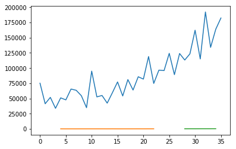


```python
print(model.summary())
```

    _________________________________________________________________
    Layer (type)                 Output Shape              Param #   
    =================================================================
    lstm_2 (LSTM)                (1, 8)                    416       
    _________________________________________________________________
    dense_3 (Dense)              (1, 10)                   90        
    _________________________________________________________________
    dense_4 (Dense)              (1, 1)                    11        
    =================================================================
    Total params: 517
    Trainable params: 517
    Non-trainable params: 0
    _________________________________________________________________
    None
    

### LSTM for Regression with Time Steps

You may have noticed that the data preparation for the LSTM network includes time steps.

Some sequence problems may have a varied number of time steps per sample. For example, you may have measurements of a physical machine leading up to a point of failure or a point of surge. Each incident would be a sample the observations that lead up to the event would be the time steps, and the variables observed would be the features.

Time steps provide another way to phrase our time series problem. Like above in the window example, we can take prior time steps in our time series as inputs to predict the output at the next time step.

Instead of phrasing the past observations as separate input features, we can use them as time steps of the one input feature, which is indeed a more accurate framing of the problem.

We can do this using the same data representation as in the previous window-based example, except when we reshape the data, we set the columns to be the time steps dimension (timesteps is not 1 anymore) and change the features dimension back to 1. Note that input_shape of the model is changed as well.


```python
# reshape X into 4 timesteps for one feature vector (Xt-3, Xt-2, Xt-1, Xt), with expected output Y at t
look_back = 4
timesteps = 4
trainX, trainY = create_dataset(train, look_back)      # trainX is input, trainY is expected output (label)
testX, testY = create_dataset(test, look_back)

# reshape input to be [samples, time steps, features]
print("Original trainX shape:", trainX.shape)
print("Original testX shape:", testX.shape)
trainX = numpy.reshape(trainX, (trainX.shape[0], trainX.shape[1], 1))   # samples = trainX.shape[0], timesteps = trainX.shape[1], features = 1
testX = numpy.reshape(testX, (testX.shape[0], testX.shape[1], 1))
print("New trainX shape:", trainX.shape)
print("New testX shape:", testX.shape)
print("trainY shape:", trainY.shape)
print("trainY example:", trainY[0])
```

    19
    7
    Original trainX shape: (19, 4, 1)
    Original testX shape: (7, 4, 1)
    New trainX shape: (19, 4, 1)
    New testX shape: (7, 4, 1)
    trainY shape: (19, 1)
    trainY example: [-0.78318816]
    


```python
model = Sequential()
batch_size = 1
input_dim = trainX.shape[2]
timesteps = trainX.shape[1]
# my_init = keras.initializers.RandomNormal(mean=0.0, stddev=0.05, seed=seed)
#model.add(LSTM(8, input_shape=(look_back, 1)))    # 4 or 8 is the number of LSTM units or dimensions of output of LSTM layer, can be any integer. input_shape must show up in the first layer
model.add(LSTM(8, batch_input_shape=(batch_size, timesteps, input_dim)))  # input_dim = 1
model.add(Dense(10))    # may not be necessary, but just want to try it
#model.add(Dropout(0.8))
model.add(Dense(1))
model.compile(loss='mean_squared_error', optimizer='adam')
model.fit(trainX, trainY, epochs=50, batch_size=batch_size, verbose=2)   # it turns out that epochs = 15 is enough, 100 is not necessary
```

    Epoch 1/50
    1s - loss: 0.1859
    Epoch 2/50
    0s - loss: 0.0594
    Epoch 3/50
    0s - loss: 0.0552
    Epoch 4/50
    0s - loss: 0.0521
    Epoch 5/50
    0s - loss: 0.0524
    Epoch 6/50
    0s - loss: 0.0530
    Epoch 7/50
    0s - loss: 0.0535
    Epoch 8/50
    0s - loss: 0.0530
    Epoch 9/50
    0s - loss: 0.0521
    Epoch 10/50
    0s - loss: 0.0513
    Epoch 11/50
    0s - loss: 0.0522
    Epoch 12/50
    0s - loss: 0.0515
    Epoch 13/50
    0s - loss: 0.0560
    Epoch 14/50
    0s - loss: 0.0502
    Epoch 15/50
    0s - loss: 0.0514
    Epoch 16/50
    0s - loss: 0.0513
    Epoch 17/50
    0s - loss: 0.0519
    Epoch 18/50
    0s - loss: 0.0516
    Epoch 19/50
    0s - loss: 0.0507
    Epoch 20/50
    0s - loss: 0.0523
    Epoch 21/50
    0s - loss: 0.0515
    Epoch 22/50
    0s - loss: 0.0513
    Epoch 23/50
    0s - loss: 0.0569
    Epoch 24/50
    0s - loss: 0.0496
    Epoch 25/50
    0s - loss: 0.0505
    Epoch 26/50
    0s - loss: 0.0521
    Epoch 27/50
    0s - loss: 0.0520
    Epoch 28/50
    0s - loss: 0.0509
    Epoch 29/50
    0s - loss: 0.0506
    Epoch 30/50
    0s - loss: 0.0506
    Epoch 31/50
    0s - loss: 0.0505
    Epoch 32/50
    0s - loss: 0.0503
    Epoch 33/50
    0s - loss: 0.0518
    Epoch 34/50
    0s - loss: 0.0551
    Epoch 35/50
    0s - loss: 0.0498
    Epoch 36/50
    0s - loss: 0.0526
    Epoch 37/50
    0s - loss: 0.0508
    Epoch 38/50
    0s - loss: 0.0525
    Epoch 39/50
    0s - loss: 0.0525
    Epoch 40/50
    0s - loss: 0.0532
    Epoch 41/50
    0s - loss: 0.0521
    Epoch 42/50
    0s - loss: 0.0556
    Epoch 43/50
    0s - loss: 0.0510
    Epoch 44/50
    0s - loss: 0.0505
    Epoch 45/50
    0s - loss: 0.0531
    Epoch 46/50
    0s - loss: 0.0510
    Epoch 47/50
    0s - loss: 0.0501
    Epoch 48/50
    0s - loss: 0.0498
    Epoch 49/50
    0s - loss: 0.0502
    Epoch 50/50
    0s - loss: 0.0501
    


    <keras.callbacks.History at 0x16c1c0f0>


```python
# make predictions
trainPredict = model.predict(trainX, batch_size=batch_size)   # can't omit batch_size which must be the same as that in model.fit()
testPredict = model.predict(testX, batch_size=batch_size)      

# invert predictions
trainPredict = scaler.inverse_transform(trainPredict)
trainY = scaler.inverse_transform(trainY)               # trainY is of shape (samples, features) while trainX is of (samples, timesteps, features) )
testPredict = scaler.inverse_transform(testPredict)
testY = scaler.inverse_transform(testY)

print("trainY shape:", trainY.shape)
print("trainPredict shape:", trainPredict.shape)
print("testY shape:", testY.shape)
print("testPredict shape:", testPredict.shape)

# calculate root mean squared error
trainScore = math.sqrt(mean_squared_error(trainY, trainPredict))
print('Train Score: %.2f RMSE' % (trainScore))
testScore = math.sqrt(mean_squared_error(testY, testPredict))
print('Test Score: %.2f RMSE' % (testScore))
```

    trainY shape: (19, 1)
    trainPredict shape: (19, 1)
    testY shape: (7, 1)
    testPredict shape: (7, 1)
    Train Score: 62.18 RMSE
    Test Score: 139.78 RMSE
    


```python
# shift train predictions for plotting
trainPredictPlot = numpy.empty_like(dataset)
trainPredictPlot[:, :] = numpy.nan
#print(trainPredictPlot[0])
trainPredictPlot[look_back:len(trainPredict)+look_back, :] = trainPredict

# shift test predictions for plotting
testPredictPlot = numpy.empty_like(dataset)
testPredictPlot[:, :] = numpy.nan
testPredictPlot[len(trainPredict)+(look_back*2)+1:len(dataset)-1, :] = testPredict
```


```python
# plot baseline and predictions
plt.plot(scaler.inverse_transform(dataset_scaled))
plt.plot(trainPredictPlot)
plt.plot(testPredictPlot)
plt.show()
```


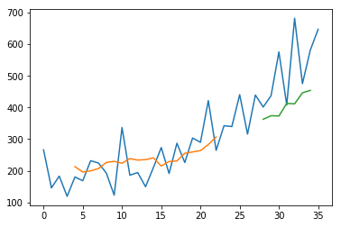


### LSTM with Memory Between Batches

The LSTM network has memory, which is capable of remembering across long sequences.

Normally, the state within the network is reset after each training batch when fitting the model, as well as each call to **model.predict()** or **model.evaluate()**.

We can gain finer control over when the internal state of the LSTM network is cleared in Keras by making the LSTM layer **stateful**. This means that it can build state over the entire training sequence and even maintain that state if needed to make predictions.

*Jiyang's note: "state" is what one unit sends to the next units or itself (i.e. memory), which is different from weights and outputs.*

It requires that the training data **not be shuffled** when fitting the network. It also requires explicit resetting of the network state after each exposure to the training data (epoch) by calls to **model.reset_states()**. This means that we must create our own outer loop of epochs and within each epoch call **model.fit()** and **model.reset_states()**. 

*Jiyang's note: I set shuffle=True in model.fit and unexpectedly got better test accuracy vs. shuffle=False (43 vs. 72) as I thought shuffle or not doesn't matte when batch_size = 1. *


```python
# reshape into 4 timesteps for one feature (Xt-3, Xt-2, Xt-1, Xt), with expected output Y at t
look_back = 4
trainX, trainY = create_dataset(train, look_back)      # trainX is input, trainY is expected output
testX, testY = create_dataset(test, look_back)

# reshape input to be [samples, time steps, features]
print("Original trainX shape:", trainX.shape)
print("Original testX shape:", testX.shape)
trainX = numpy.reshape(trainX, (trainX.shape[0], trainX.shape[1], 1))   # timesteps = trainX.shape[1], input_dim = 1
testX = numpy.reshape(testX, (testX.shape[0], testX.shape[1], 1))
print("New trainX shape:", trainX.shape)
print("New testX shape:", testX.shape)
print("trainY shape:", trainY.shape)
print("trainY example:", trainY[0])
```

    19
    7
    Original trainX shape: (19, 4, 1)
    Original testX shape: (7, 4, 1)
    New trainX shape: (19, 4, 1)
    New testX shape: (7, 4, 1)
    trainY shape: (19, 1)
    trainY example: [-0.78318816]
    


```python
batch_size = 1
timesteps = trainX.shape[1]
input_dim = trainX.shape[2]

model = Sequential()

model.add(LSTM(8, batch_input_shape=(batch_size, timesteps, input_dim), stateful=True))
model.add(Dense(10)) 
model.add(Dense(1))
model.compile(loss='mean_squared_error', optimizer='adam')
for i in range(50):    # corresponding to epochs = 50
	model.fit(trainX, trainY, epochs=1, batch_size=batch_size, verbose=2, shuffle=False)
	model.reset_states()
```

    Epoch 1/1
    1s - loss: 0.3508
    Epoch 1/1
    0s - loss: 0.1394
    Epoch 1/1
    0s - loss: 0.0755
    Epoch 1/1
    0s - loss: 0.0645
    Epoch 1/1
    0s - loss: 0.0634
    Epoch 1/1
    0s - loss: 0.0645
    Epoch 1/1
    0s - loss: 0.0642
    Epoch 1/1
    0s - loss: 0.0637
    Epoch 1/1
    0s - loss: 0.0634
    Epoch 1/1
    0s - loss: 0.0631
    Epoch 1/1
    0s - loss: 0.0629
    Epoch 1/1
    0s - loss: 0.0626
    Epoch 1/1
    0s - loss: 0.0624
    Epoch 1/1
    0s - loss: 0.0621
    Epoch 1/1
    0s - loss: 0.0619
    Epoch 1/1
    0s - loss: 0.0617
    Epoch 1/1
    0s - loss: 0.0615
    Epoch 1/1
    0s - loss: 0.0613
    Epoch 1/1
    0s - loss: 0.0611
    Epoch 1/1
    0s - loss: 0.0609
    Epoch 1/1
    0s - loss: 0.0607
    Epoch 1/1
    0s - loss: 0.0605
    Epoch 1/1
    0s - loss: 0.0603
    Epoch 1/1
    0s - loss: 0.0602
    Epoch 1/1
    0s - loss: 0.0600
    Epoch 1/1
    0s - loss: 0.0598
    Epoch 1/1
    0s - loss: 0.0597
    Epoch 1/1
    0s - loss: 0.0595
    Epoch 1/1
    0s - loss: 0.0594
    Epoch 1/1
    0s - loss: 0.0592
    Epoch 1/1
    0s - loss: 0.0591
    Epoch 1/1
    0s - loss: 0.0589
    Epoch 1/1
    0s - loss: 0.0588
    Epoch 1/1
    0s - loss: 0.0587
    Epoch 1/1
    0s - loss: 0.0586
    Epoch 1/1
    0s - loss: 0.0584
    Epoch 1/1
    0s - loss: 0.0583
    Epoch 1/1
    0s - loss: 0.0582
    Epoch 1/1
    0s - loss: 0.0581
    Epoch 1/1
    0s - loss: 0.0580
    Epoch 1/1
    0s - loss: 0.0578
    Epoch 1/1
    0s - loss: 0.0577
    Epoch 1/1
    0s - loss: 0.0576
    Epoch 1/1
    0s - loss: 0.0575
    Epoch 1/1
    0s - loss: 0.0574
    Epoch 1/1
    0s - loss: 0.0573
    Epoch 1/1
    0s - loss: 0.0572
    Epoch 1/1
    0s - loss: 0.0571
    Epoch 1/1
    0s - loss: 0.0570
    Epoch 1/1
    0s - loss: 0.0569
    


```python
# make predictions
trainPredict = model.predict(trainX, batch_size=batch_size)
model.reset_states()  # this sentence should not be neglected.
testPredict = model.predict(testX, batch_size=batch_size)

# invert predictions
trainPredict = scaler.inverse_transform(trainPredict)
trainY_new = scaler.inverse_transform(trainY)               # trainY is of shape (samples, features) while trainX is of (samples, timesteps, features) )
testPredict = scaler.inverse_transform(testPredict)
testY_new = scaler.inverse_transform(testY)

print("trainY shape:", trainY_new.shape)
print("trainPredict shape:", trainPredict.shape)
print("testY shape:", testY_new.shape)
print("testPredict shape:", testPredict.shape)

# calculate root mean squared error
trainScore = math.sqrt(mean_squared_error(trainY_new, trainPredict))
print('Train Score: %.2f RMSE' % (trainScore))
testScore = math.sqrt(mean_squared_error(testY_new, testPredict))
print('Test Score: %.2f RMSE' % (testScore))
```

    trainY shape: (19, 1)
    trainPredict shape: (19, 1)
    testY shape: (7, 1)
    testPredict shape: (7, 1)
    Train Score: 66.25 RMSE
    Test Score: 174.64 RMSE
    


```python
# shift train predictions for plotting
trainPredictPlot = numpy.empty_like(dataset)
trainPredictPlot[:, :] = numpy.nan
#print(trainPredictPlot[0])
trainPredictPlot[look_back:len(trainPredict)+look_back, :] = trainPredict

# shift test predictions for plotting
testPredictPlot = numpy.empty_like(dataset)
testPredictPlot[:, :] = numpy.nan
testPredictPlot[len(trainPredict)+(look_back*2)+1:len(dataset)-1, :] = testPredict
```


```python
# plot baseline and predictions
plt.plot(scaler.inverse_transform(dataset_scaled))
plt.plot(trainPredictPlot)
plt.plot(testPredictPlot)
plt.show()
```


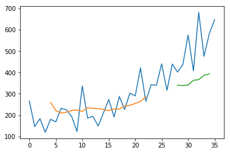


### Stacked LSTMs with Memory Between Batches

Finally, we will take a look at one of the big benefits of LSTMs: the fact that they can be successfully trained when stacked into deep network architectures.

LSTM networks can be stacked in Keras in the same way that other layer types can be stacked. One addition to the configuration that is required is that an LSTM layer prior to each subsequent LSTM layer must return the sequence. This can be done by setting the **return_sequences** parameter on the layer to **True**.

Jiyang's note: just like ConvNet, better performance can be obtained when the number of LSTM units in higher layer is higher than (not even equal to) that in the lower layer.


```python
# reshape into 4 timesteps for one feature (Xt-3, Xt-2, Xt-1, Xt), with expected output Y at t
look_back = 4
trainX, trainY = create_dataset(train, look_back)      # trainX is input, trainY is expected output
testX, testY = create_dataset(test, look_back)

# reshape input to be [samples, time steps, features]
print("Original trainX shape:", trainX.shape)
print("Original testX shape:", testX.shape)
trainX = numpy.reshape(trainX, (trainX.shape[0], trainX.shape[1], 1))
testX = numpy.reshape(testX, (testX.shape[0], testX.shape[1], 1))
print("New trainX shape:", trainX.shape)
print("New testX shape:", testX.shape)
print("trainY shape:", trainY.shape)
print("trainY example:", trainY[0])
```

    19
    7
    Original trainX shape: (19, 4, 1)
    Original testX shape: (7, 4, 1)
    New trainX shape: (19, 4, 1)
    New testX shape: (7, 4, 1)
    trainY shape: (19, 1)
    trainY example: [-0.78318816]
    


```python
batch_size = 1
model = Sequential()

# model.add(LSTM(8, batch_input_shape=(batch_size, look_back, 1), stateful=True))
model.add(LSTM(4, batch_input_shape=(batch_size, look_back, 1), stateful=True, return_sequences=True))
model.add(LSTM(8, batch_input_shape=(batch_size, look_back, 1), stateful=True))

model.add(Dense(10)) 
model.add(Dense(1))

model.compile(loss='mean_squared_error', optimizer='adam')

for i in range(50):    # corresponding to epochs = 50
	model.fit(trainX, trainY, epochs=1, batch_size=batch_size, verbose=2, shuffle=True)
	model.reset_states()
```

    Epoch 1/1
    2s - loss: 0.4858
    Epoch 1/1
    0s - loss: 0.3055
    Epoch 1/1
    0s - loss: 0.1929
    Epoch 1/1
    0s - loss: 0.1272
    Epoch 1/1
    0s - loss: 0.0805
    Epoch 1/1
    0s - loss: 0.0674
    Epoch 1/1
    0s - loss: 0.0582
    Epoch 1/1
    0s - loss: 0.0658
    Epoch 1/1
    0s - loss: 0.0625
    Epoch 1/1
    0s - loss: 0.0614
    Epoch 1/1
    0s - loss: 0.0583
    Epoch 1/1
    0s - loss: 0.0617
    Epoch 1/1
    0s - loss: 0.0600
    Epoch 1/1
    0s - loss: 0.0611
    Epoch 1/1
    0s - loss: 0.0613
    Epoch 1/1
    0s - loss: 0.0603
    Epoch 1/1
    0s - loss: 0.0600
    Epoch 1/1
    0s - loss: 0.0636
    Epoch 1/1
    0s - loss: 0.0620
    Epoch 1/1
    0s - loss: 0.0652
    Epoch 1/1
    0s - loss: 0.0603
    Epoch 1/1
    0s - loss: 0.0614
    Epoch 1/1
    0s - loss: 0.0582
    Epoch 1/1
    0s - loss: 0.0630
    Epoch 1/1
    0s - loss: 0.0615
    Epoch 1/1
    0s - loss: 0.0624
    Epoch 1/1
    0s - loss: 0.0626
    Epoch 1/1
    0s - loss: 0.0562
    Epoch 1/1
    0s - loss: 0.0618
    Epoch 1/1
    0s - loss: 0.0606
    Epoch 1/1
    0s - loss: 0.0617
    Epoch 1/1
    0s - loss: 0.0633
    Epoch 1/1
    0s - loss: 0.0604
    Epoch 1/1
    0s - loss: 0.0599
    Epoch 1/1
    0s - loss: 0.0617
    Epoch 1/1
    0s - loss: 0.0597
    Epoch 1/1
    0s - loss: 0.0608
    Epoch 1/1
    0s - loss: 0.0580
    Epoch 1/1
    0s - loss: 0.0629
    Epoch 1/1
    0s - loss: 0.0564
    Epoch 1/1
    0s - loss: 0.0623
    Epoch 1/1
    0s - loss: 0.0631
    Epoch 1/1
    0s - loss: 0.0609
    Epoch 1/1
    0s - loss: 0.0618
    Epoch 1/1
    0s - loss: 0.0607
    Epoch 1/1
    0s - loss: 0.0584
    Epoch 1/1
    0s - loss: 0.0566
    Epoch 1/1
    0s - loss: 0.0599
    Epoch 1/1
    0s - loss: 0.0613
    Epoch 1/1
    0s - loss: 0.0540
    


```python
# make predictions
trainPredict = model.predict(trainX, batch_size=batch_size)

model.reset_states()  # this sentence should not be neglected.
testPredict = model.predict(testX, batch_size=batch_size)

# invert predictions
trainPredict = scaler.inverse_transform(trainPredict)
trainY = scaler.inverse_transform(trainY)               # trainY is of shape (samples, features) while trainX is of (samples, timesteps, features) )
testPredict = scaler.inverse_transform(testPredict)
testY = scaler.inverse_transform(testY)

print("trainY shape:", trainY.shape)
print("trainPredict shape:", trainPredict.shape)
print("testY shape:", testY.shape)
print("testPredict shape:", testPredict.shape)

# calculate root mean squared error
trainScore = math.sqrt(mean_squared_error(trainY, trainPredict))
print('Train Score: %.2f RMSE' % (trainScore))
testScore = math.sqrt(mean_squared_error(testY, testPredict))
print('Test Score: %.2f RMSE' % (testScore))
```

    trainY shape: (19, 1)
    trainPredict shape: (19, 1)
    testY shape: (7, 1)
    testPredict shape: (7, 1)
    Train Score: 65.33 RMSE
    Test Score: 207.50 RMSE
    


```python
# shift train predictions for plotting
trainPredictPlot = numpy.empty_like(dataset)
trainPredictPlot[:, :] = numpy.nan
#print(trainPredictPlot[0])
trainPredictPlot[look_back:len(trainPredict)+look_back, :] = trainPredict

# shift test predictions for plotting
testPredictPlot = numpy.empty_like(dataset)
testPredictPlot[:, :] = numpy.nan
testPredictPlot[len(trainPredict)+(look_back*2)+1:len(dataset)-1, :] = testPredict
```


```python
# plot baseline and predictions
plt.plot(scaler.inverse_transform(dataset_scaled))
plt.plot(trainPredictPlot)
plt.plot(testPredictPlot)
plt.show()
```


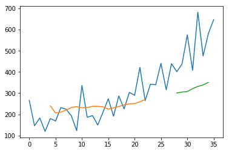


## Shampoo Sales Forecast

This dataset describes the monthly number of sales of shampoo over a 3-year period, from https://datamarket.com/data/set/22r0/sales-of-shampoo-over-a-three-year-period.

The units are a sales count and there are 36 observations.


```python
import pandas
import matplotlib.pyplot as plt

# 1st column of csv file is "date" which we don't need. And 3 footer lines can also be skipped.
dataset = pandas.read_csv('shampoo-sales.csv', usecols=[1], engine='python',skipfooter=1)

plt.plot(dataset)
plt.show()
```


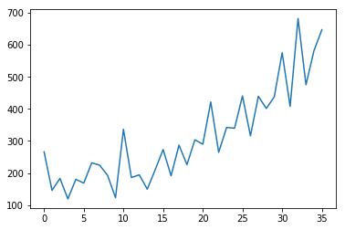


```python
print(dataset.head())
```

       Sales of shampoo over a three year period
    0                                      266.0
    1                                      145.9
    2                                      183.1
    3                                      119.3
    4                                      180.3
    


```python
# load the dataset
dataframe = pandas.read_csv('shampoo-sales.csv', usecols=[1], engine='python', skipfooter=2)
dataset = dataframe.values
dataset = dataset.astype('float32')
print(dataset)
```

    [[ 266.        ]
     [ 145.8999939 ]
     [ 183.1000061 ]
     [ 119.30000305]
     [ 180.30000305]
     [ 168.5       ]
     [ 231.80000305]
     [ 224.5       ]
     [ 192.80000305]
     [ 122.90000153]
     [ 336.5       ]
     [ 185.8999939 ]
     [ 194.30000305]
     [ 149.5       ]
     [ 210.1000061 ]
     [ 273.29998779]
     [ 191.3999939 ]
     [ 287.        ]
     [ 226.        ]
     [ 303.6000061 ]
     [ 289.8999939 ]
     [ 421.6000061 ]
     [ 264.5       ]
     [ 342.29998779]
     [ 339.70001221]
     [ 440.3999939 ]
     [ 315.8999939 ]
     [ 439.29998779]
     [ 401.29998779]
     [ 437.3999939 ]
     [ 575.5       ]
     [ 407.6000061 ]
     [ 682.        ]
     [ 475.29998779]
     [ 581.29998779]
     [ 646.90002441]]
    


```python
# split data into train and test
train, test = dataset[0:-12], dataset[-12:]     # the last 12 items are for test, the rest for training
```

### Persistence Model Forecast - Baseline

A good baseline forecast for a time series with a linear increasing trend is a persistence forecast.

The persistence forecast is where the observation from the prior time step (t-1) is used to predict the observation at the current time step (t).

We can implement this by taking the last observation from the training data and history accumulated by walk-forward validation and using that to predict the current time step.


```python
from pandas import read_csv
from pandas import datetime
from sklearn.metrics import mean_squared_error
from math import sqrt
from matplotlib import pyplot

# load dataset

def parser(x):
	return datetime.strptime('201'+x, '%Y-%m')   # add year to months, and using format yyyy-mm

series = read_csv('shampoo-sales.csv', engine='python', delimiter = ',', index_col=0, header=0, parse_dates=[0], skipfooter=2, squeeze=True, skip_blank_lines=True, date_parser=parser)
# skipfooter = 2 must be added so that the last two rows (an empty row and a footer row) will not be converted to 201y-mm, which also requires engine='python'
print("series shape:", series.shape)
print(series.head())

# line plot
series.plot()
pyplot.show()

```

    series shape: (36,)
    Month
    2011-01-01    266.0
    2011-02-01    145.9
    2011-03-01    183.1
    2011-04-01    119.3
    2011-05-01    180.3
    Name: Sales of shampoo over a three year period, dtype: float64
    


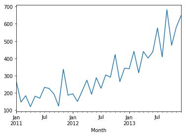


```python
data_values = series.values
print("data values shape:", data_values.shape)
print(data_values[0:5])
```

    data values shape: (36,)
    [ 266.   145.9  183.1  119.3  180.3]
    


```python
# split data into train and test
X = series.values   # X is still a column vector with 36 rows
#X = dataset
train, test = X[0:-12], X[-12:]

# walk-forward validation
history = [x for x in train]
predictions = list()
for i in range(len(test)):
	# make prediction
	predictions.append(history[-1])
	# observation
	history.append(test[i])

    # report performance
rmse = sqrt(mean_squared_error(test, predictions))
print('RMSE: %.3f' % rmse)
# line plot of observed vs predicted
pyplot.plot(test)
pyplot.plot(predictions)
pyplot.show()
```

    RMSE: 136.761
    


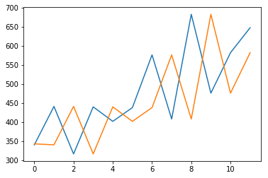


### LSTM Data Preparation

Before we can fit an LSTM model to the dataset, we must transform the data.

This section is broken down into three steps:

- Transform the time series into a supervised learning problem
- Transform the time series data so that it is stationary.
- Transform the observations to have a specific scale.

#### Transform Time Series to Supervised Learning

The LSTM model in Keras assumes that your data is divided into input (X) and output (y) components.

For a time series problem, we can achieve this by using the observation from the last time step (t-1) as the input and the observation at the current time step (t) as the output.

We can achieve this using the **shift()** function in Pandas that will push all values in a series down by a specified number places. We require a shift of 1 place, which will become the input variables. The time series as it stands will be the output variables.

We can then concatenate these two series together to create a DataFrame ready for supervised learning. The pushed-down series will have a new position at the top with no value. A NaN (not a number) value will be used in this position. We will replace these NaN values with 0 values, which the LSTM model will have to learn as the start of the series or have no data here, such as a month with zero sales on this dataset has not been observed.

The code below defines a helper function to do this called **timeseries_to_supervised()**. It takes a NumPy array of the raw time series data and a lag or number of shifted series to create and use as inputs.


```python
from pandas import read_csv
from pandas import datetime
from pandas import DataFrame
from pandas import concat

def timeseries_to_supervised(data, lag=1):
    """Frame a sequence data into a supervised learning problem, i.e., time sequence -> (X, y)"""
    df = DataFrame(data)               # DataFrame is a pandas class
    columns = [df.shift(i) for i in range(1, lag+1)]   # shift() pushed dataframe or a column vector downwards by i spaces
    columns.append(df)      # append the original as the output y onto the last column
    df = concat(columns, axis=1)
    df.fillna(0, inplace=True)   # turn NaN to 0
    return df
```


```python
X = series.values
lags = 4
supervised = timeseries_to_supervised(X, lag = lags)
print(supervised.head())
```

           0      0      0      0      0
    0    0.0    0.0    0.0    0.0  266.0
    1  266.0    0.0    0.0    0.0  145.9
    2  145.9  266.0    0.0    0.0  183.1
    3  183.1  145.9  266.0    0.0  119.3
    4  119.3  183.1  145.9  266.0  180.3
    


```python
import numpy as np
dataset = supervised.values     # must use values because supervised is still a dataframe but LSTM requires 3D array as input
print("Original row:\n", dataset[0:5])

X = dataset[0:5]
print("\nExclude last row, X:\n", X[0:-1])
X = X[0:-1]
print("\nShape of X:", X.shape)

X, y = X[:,0:-1], X[:, -1]
rows, cols = X.shape
X = X.reshape(rows, 1, cols)   # [samples, timestep, features]
print("\nX reshaped to 3D:\n",X)

X = X.reshape(rows, cols, 1)   # [samples, timestep, features]
print("\nX reshaped to 3D:\n",X)

print("\n y in 3D:\n", y)
```

    Original row:
     [[   0.     0.     0.     0.   266. ]
     [ 266.     0.     0.     0.   145.9]
     [ 145.9  266.     0.     0.   183.1]
     [ 183.1  145.9  266.     0.   119.3]
     [ 119.3  183.1  145.9  266.   180.3]]
    
    Exclude last row, X:
     [[   0.     0.     0.     0.   266. ]
     [ 266.     0.     0.     0.   145.9]
     [ 145.9  266.     0.     0.   183.1]
     [ 183.1  145.9  266.     0.   119.3]]
    
    Shape of X: (4, 5)
    
    X reshaped to 3D:
     [[[   0.     0.     0.     0. ]]
    
     [[ 266.     0.     0.     0. ]]
    
     [[ 145.9  266.     0.     0. ]]
    
     [[ 183.1  145.9  266.     0. ]]]
    
    X reshaped to 3D:
     [[[   0. ]
      [   0. ]
      [   0. ]
      [   0. ]]
    
     [[ 266. ]
      [   0. ]
      [   0. ]
      [   0. ]]
    
     [[ 145.9]
      [ 266. ]
      [   0. ]
      [   0. ]]
    
     [[ 183.1]
      [ 145.9]
      [ 266. ]
      [   0. ]]]
    
     y in 3D:
     [ 266.   145.9  183.1  119.3]
    

#### Transform Time Series to Stationary

The Shampoo Sales dataset is not stationary.

This means that there is a structure in the data that is dependent on the time. Specifically, there is an increasing trend in the data.

*Jiyang's comment: is the trend what we'd like the model to capture?*

Stationary data is easier to model and will very likely result in more skillful forecasts.

The trend can be removed from the observations, then added back to forecasts later to return the prediction to the original scale and calculate a comparable error score.

A standard way to remove a trend is by differencing the data. That is the observation from the previous time step (t-1) is subtracted from the current observation (t). This removes the trend and we are left with a difference series, or the changes to the observations from one time step to the next.

We can achieve this automatically using the **diff()** function in pandas. Alternatively, we can get finer grained control and write our own function to do this, which is preferred for its flexibility in this case.

Below is a function called **difference()** that calculates a differenced series. Note that the first observation in the series is skipped as there is no prior observation with which to calculate a differenced value.


```python
# create a differenced series
def difference(dataset, interval=1):
    diff = list()
    for i in range(interval, len(dataset)):
        value = dataset[i] - dataset[i - interval]
        diff.append(value)
    
    # pandas.Series() turns a list like [-120.1, 37.2, ...] to a time series
    return Series(diff)
```

We also need to invert this process in order to take forecasts made on the differenced series back into their original scale, by function  **inverse_difference()**, in which history is the data series used to get diff. Our model predicts diff that is to be converted to original scale by diff + history


```python
# invert differenced value
def inverse_difference(history, diff, interval=1):
    return diff + history[-interval]
```

We can test out these functions by differencing the whole series, then returning it to the original scale, as follows:


```python
from pandas import read_csv
from pandas import datetime
from pandas import Series

differenced = difference(series, interval=1)
print("differenced:")
print(differenced.head())

# invert transform
inverted = list()
for i in range(len(differenced)):
    value = inverse_difference(series, differenced[i], len(series)-i)
    inverted.append(value)
inverted = Series(inverted)
print("\n")
print("Inverted back:")
print(inverted.head())
```

    differenced:
    0   -120.1
    1     37.2
    2    -63.8
    3     61.0
    4    -11.8
    dtype: float64
    
    
    Inverted back:
    0    145.9
    1    183.1
    2    119.3
    3    180.3
    4    168.5
    dtype: float64
    


```python
def diff(dataset, interval=1):
    """My implementation of diff() function, avoiding using "for" loop. """
    history = dataset[0:-interval]
    new_output = dataset[interval:,]
#    print("history")
#    print(history.head())
#    print("\nnew_output")
#    print(new_output.head())
    return new_output - list(history)
```


```python
# invert differenced value
def inverse_diff(original, diff, interval=1):
    history = original[-interval]
#    print("History")
#    print(history.head())
    return diff + history
```


```python
differenced = diff(series, 1)
print(differenced[0:5])
```

    Month
    2011-02-01   -120.1
    2011-03-01     37.2
    2011-04-01    -63.8
    2011-05-01     61.0
    2011-06-01    -11.8
    Name: Sales of shampoo over a three year period, dtype: float64
    


```python
inverted = inverse_diff(series, differenced, 1)
```


```python
print("series:")
print(series.head())
print("\nDiff:")
print(differenced.head())
print("\nInverted back:")

print(inverted.head())
```

    series:
    Month
    2011-01-01    266.0
    2011-02-01    145.9
    2011-03-01    183.1
    2011-04-01    119.3
    2011-05-01    180.3
    Name: Sales of shampoo over a three year period, dtype: float64
    
    Diff:
    Month
    2011-02-01   -120.1
    2011-03-01     37.2
    2011-04-01    -63.8
    2011-05-01     61.0
    2011-06-01    -11.8
    Name: Sales of shampoo over a three year period, dtype: float64
    
    Inverted back:
    Month
    2011-02-01    526.8
    2011-03-01    684.1
    2011-04-01    583.1
    2011-05-01    707.9
    2011-06-01    635.1
    Name: Sales of shampoo over a three year period, dtype: float64
    


```python
def dataset_split(dataset, train_ratio):
    """ Split dataset into train and test set by ratio of train_ratio (e.g., 0.7 for 70%). """
    train_size = int(len(dataset) * train_ratio)
    test_size = len(dataset) - train_size
    train, test = dataset[0:train_size], dataset[train_size:len(dataset)]
    
    return train, test

def data_scale(dataset, feature_range=(0,1)):
    """Normalize the dataset to the range of feature_range (e.g., [-1, 1]).
       Scaler can also de-normalize the dataset by scaler.inverse_transform(), useful for actual prediction.
    """
    scaler = MinMaxScaler(feature_range)
    scaled_data = scaler.fit_transform(dataset)
    return scaler, scaled_data

def data_inverse_scale(scaler, dataset):
    data_array = numpy.array([dataset])
    # print("data_array shape:", data_array.shape)
    data_array = data_array.reshape(1, len(data_array))
    return scaler.inverse_transform(data_array)

```


```python
def fit_lstm(units, trainset, model_style='window', with_memory=False, epochs=50): 
    
    X, y = trainset[:, 0:-1], trainset[:, -1]    # the last column is y, the rest belongs to X (which excludes the last column)

    # For LSTM model, the batch_input_shape must be in the form of (batch_size, timesteps, input_dim).    
    # X.shape[0] provides the number of samples (rows) which is usually used as batch_size depending on the model style.
    # X.shape[1] provides the number of columns of X, which is usually used as the input_dim depending on the model style.
    # timesteps may or may not be 1.
    # If with_memory=True, then batch_size=1, epochs is used in "for" loop
    # If the model is window style, input has multi-dimentions while timesteps is 1. So batch_input_shape = (trainX.shape[0], timesteps = 1, input_dim = trainX.shape[1])
    # If the model is timestep style, then batch_input_size = (trainX.shape[0], timesteps = lags, input_dim = 1).
    # Note that after reshaping from 2D to 3D, .shape[0] and .shape[1] become .shape[1] and .shape[2].
    
    samples = X.shape[0]   # number of samples in the training set
    
    if model_style is 'window':
        timesteps = 1
        input_dim = X.shape[1]
    elif model_style is 'timestep':
        timesteps = X.shape[1]
        input_dim = 1
    
    X = X.reshape(samples, timesteps, input_dim)   # turn X from 2D to 3D
    
    batch_size = 1         # always 1 for time-series models
    timesteps = X.shape[1]
    input_dim = X.shape[2]
    
    batch_input_shape=(batch_size, timesteps, input_dim)
    
    model = Sequential()
    
    if with_memory is True:
        
        model.add(LSTM(units, batch_input_shape= batch_input_shape, stateful=True))
        # model.add(LSTM(8, batch_input_shape=(batch_size, look_back, 1), stateful=True))

        model.add(Dense(10)) 
        model.add(Dense(1))
        
        model.compile(loss='mean_squared_error', optimizer='adam')
        
        for i in range(epochs):
            model.fit(X, y, epochs=1, batch_size=batch_size, verbose=2, shuffle=False)
            model.reset_states()
            
    else:
        model.add(LSTM(units, batch_input_shape= batch_input_shape))
        model.add(Dense(10))
        #model.add(Dropout(0.8))
        model.add(Dense(1))
        model.compile(loss='mean_squared_error', optimizer='adam')
        model.fit(X, y, epochs=epochs, batch_size=batch_size, verbose=2) 
    
    return model
```


```python
def forecast_lstm(model, data, batch_size=1, model_style='window'):
    """ Making predictions that support two modes: static mode and dynamic mode.
        
        In static mode, input data has only one row and 2D, so should be reshaped to 3D first by adding batch_size to the 1st dimension.
        Output of model.predict has 2D of 1x1 array, and this function returns its value, so takes the value from array by index [0, 0].
        
        Note that to maintain consistency with dynamic mode (see below), input data includes the last column which sould be split into X
        and y (last column) before everything else because dynamic mode requires y (labels) in addition to X but static mode doesn't.
        
        In dynamic mode, input data has multiple rows and the model will be "fit" over input data again except its last row.
        Then predict is made over the last row.
    """
    X, y = data[:, 0:-1], data[:, -1]
    
    rows, cols = X.shape     # no matter what mode, input data has 2D with 1 or multiple rows
    # print('rows=%d, cols=%d' % (rows, cols))
    
    if model_style is 'window':
        timesteps = 1
        input_dim = cols
    elif model_style is 'timestep':
        timesteps = cols
        input_dim = 1
        
    X = X.reshape(batch_size, timesteps, input_dim)   # trun 2D input data to 3D that is required by LSTM model

    predict_data = model.predict(X, batch_size=batch_size)
    ret_value = predict_data[0, 0]       # get the value from 1x1 array predict_data
    
    return ret_value

```


```python
# load dataset
series = read_csv('shampoo-sales.csv', engine='python', delimiter = ',', index_col=0, header=0, parse_dates=[0], skipfooter=2, squeeze=True, skip_blank_lines=True, date_parser=parser)
# skipfooter = 2 must be added so that the last two rows (an empty row and a footer row) will not be converted to 201y-mm, which also requires engine='python'
print(series.head())

# line plot
series.plot()
pyplot.show()

```

    Month
    2011-01-01    266.0
    2011-02-01    145.9
    2011-03-01    183.1
    2011-04-01    119.3
    2011-05-01    180.3
    Name: Sales of shampoo over a three year period, dtype: float64
    


```python
raw_values = series.values
```


```python
print("Shape of dataset:", raw_values.shape)
print("5 samples of dataset:", raw_values[0:5])
```

    Shape of dataset: (36,)
    5 samples of dataset: [ 266.   145.9  183.1  119.3  180.3]
    


```python
from pandas import Series

diff_values = difference(raw_values, interval=1)
print(diff_values[0:5])
```

    0   -120.1
    1     37.2
    2    -63.8
    3     61.0
    4    -11.8
    dtype: float64
    


```python
diff_values = diff(raw_values, interval=1)
print(diff_values[0:5])
```

    [-120.1   37.2  -63.8   61.   -11.8]
    


```python
inv_diff = inverse_diff(raw_values, diff_values, interval=1)
print(inv_diff[0:5])
```

    [ 526.8  684.1  583.1  707.9  635.1]
    


```python
diff_values = diff_values.reshape(-1, 1)
print(diff_values.shape)
scaler, data_scaled = data_scale(diff_values, feature_range=(-1,1))
```

    (35, 1)
    


```python
lags = 1
supervised_dataframe = timeseries_to_supervised(data_scaled, lag=lags)
```


```python
supervised_data = supervised_dataframe.values
```


```python
train, test = dataset_split(supervised_data, train_ratio=0.67)
```


```python
print(train.shape)
```

    (23, 2)
    


```python
units = 8
epochs = 100
model = fit_lstm(units, train, model_style='timestep', with_memory=False, epochs=epochs)
```

    Epoch 1/100
    1s - loss: 0.1632
    Epoch 2/100
    0s - loss: 0.1546
    Epoch 3/100
    0s - loss: 0.1444
    Epoch 4/100
    0s - loss: 0.1395
    Epoch 5/100
    0s - loss: 0.1324
    Epoch 6/100
    0s - loss: 0.1275
    Epoch 7/100
    0s - loss: 0.1207
    Epoch 8/100
    0s - loss: 0.1159
    Epoch 9/100
    0s - loss: 0.1105
    Epoch 10/100
    0s - loss: 0.1067
    Epoch 11/100
    0s - loss: 0.0983
    Epoch 12/100
    0s - loss: 0.0929
    Epoch 13/100
    0s - loss: 0.0892
    Epoch 14/100
    0s - loss: 0.0857
    Epoch 15/100
    0s - loss: 0.0828
    Epoch 16/100
    0s - loss: 0.0818
    Epoch 17/100
    0s - loss: 0.0822
    Epoch 18/100
    0s - loss: 0.0791
    Epoch 19/100
    0s - loss: 0.0819
    Epoch 20/100
    0s - loss: 0.0809
    Epoch 21/100
    0s - loss: 0.0808
    Epoch 22/100
    0s - loss: 0.0774
    Epoch 23/100
    0s - loss: 0.0773
    Epoch 24/100
    0s - loss: 0.0778
    Epoch 25/100
    0s - loss: 0.0773
    Epoch 26/100
    0s - loss: 0.0776
    Epoch 27/100
    0s - loss: 0.0767
    Epoch 28/100
    0s - loss: 0.0767
    Epoch 29/100
    0s - loss: 0.0769
    Epoch 30/100
    0s - loss: 0.0774
    Epoch 31/100
    0s - loss: 0.0778
    Epoch 32/100
    0s - loss: 0.0811
    Epoch 33/100
    0s - loss: 0.0767
    Epoch 34/100
    0s - loss: 0.0765
    Epoch 35/100
    0s - loss: 0.0770
    Epoch 36/100
    0s - loss: 0.0761
    Epoch 37/100
    0s - loss: 0.0768
    Epoch 38/100
    0s - loss: 0.0771
    Epoch 39/100
    0s - loss: 0.0761
    Epoch 40/100
    0s - loss: 0.0763
    Epoch 41/100
    0s - loss: 0.0766
    Epoch 42/100
    0s - loss: 0.0762
    Epoch 43/100
    0s - loss: 0.0759
    Epoch 44/100
    0s - loss: 0.0777
    Epoch 45/100
    0s - loss: 0.0767
    Epoch 46/100
    0s - loss: 0.0762
    Epoch 47/100
    0s - loss: 0.0788
    Epoch 48/100
    0s - loss: 0.0763
    Epoch 49/100
    0s - loss: 0.0761
    Epoch 50/100
    0s - loss: 0.0763
    Epoch 51/100
    0s - loss: 0.0760
    Epoch 52/100
    0s - loss: 0.0766
    Epoch 53/100
    0s - loss: 0.0769
    Epoch 54/100
    0s - loss: 0.0761
    Epoch 55/100
    0s - loss: 0.0760
    Epoch 56/100
    0s - loss: 0.0757
    Epoch 57/100
    0s - loss: 0.0764
    Epoch 58/100
    0s - loss: 0.0760
    Epoch 59/100
    0s - loss: 0.0754
    Epoch 60/100
    0s - loss: 0.0774
    Epoch 61/100
    0s - loss: 0.0747
    Epoch 62/100
    0s - loss: 0.0754
    Epoch 63/100
    0s - loss: 0.0753
    Epoch 64/100
    0s - loss: 0.0757
    Epoch 65/100
    0s - loss: 0.0756
    Epoch 66/100
    0s - loss: 0.0758
    Epoch 67/100
    0s - loss: 0.0750
    Epoch 68/100
    0s - loss: 0.0756
    Epoch 69/100
    0s - loss: 0.0758
    Epoch 70/100
    0s - loss: 0.0752
    Epoch 71/100
    0s - loss: 0.0752
    Epoch 72/100
    0s - loss: 0.0750
    Epoch 73/100
    0s - loss: 0.0755
    Epoch 74/100
    0s - loss: 0.0748
    Epoch 75/100
    0s - loss: 0.0759
    Epoch 76/100
    0s - loss: 0.0749
    Epoch 77/100
    0s - loss: 0.0756
    Epoch 78/100
    0s - loss: 0.0752
    Epoch 79/100
    0s - loss: 0.0748
    Epoch 80/100
    0s - loss: 0.0749
    Epoch 81/100
    0s - loss: 0.0750
    Epoch 82/100
    0s - loss: 0.0758
    Epoch 83/100
    0s - loss: 0.0754
    Epoch 84/100
    0s - loss: 0.0751
    Epoch 85/100
    0s - loss: 0.0771
    Epoch 86/100
    0s - loss: 0.0753
    Epoch 87/100
    0s - loss: 0.0749
    Epoch 88/100
    0s - loss: 0.0750
    Epoch 89/100
    0s - loss: 0.0754
    Epoch 90/100
    0s - loss: 0.0753
    Epoch 91/100
    0s - loss: 0.0753
    Epoch 92/100
    0s - loss: 0.0746
    Epoch 93/100
    0s - loss: 0.0749
    Epoch 94/100
    0s - loss: 0.0753
    Epoch 95/100
    0s - loss: 0.0766
    Epoch 96/100
    0s - loss: 0.0759
    Epoch 97/100
    0s - loss: 0.0753
    Epoch 98/100
    0s - loss: 0.0748
    Epoch 99/100
    0s - loss: 0.0748
    Epoch 100/100
    0s - loss: 0.0754
    


```python
model_ts_mem = fit_lstm(units, train, model_style='window', with_memory=True, epochs=epochs)
```

    Epoch 1/1
    1s - loss: 0.1478
    Epoch 1/1
    0s - loss: 0.1365
    Epoch 1/1
    0s - loss: 0.1301
    Epoch 1/1
    0s - loss: 0.1254
    Epoch 1/1
    0s - loss: 0.1211
    Epoch 1/1
    0s - loss: 0.1169
    Epoch 1/1
    0s - loss: 0.1125
    Epoch 1/1
    0s - loss: 0.1077
    Epoch 1/1
    0s - loss: 0.1028
    Epoch 1/1
    0s - loss: 0.0977
    Epoch 1/1
    0s - loss: 0.0926
    Epoch 1/1
    0s - loss: 0.0878
    Epoch 1/1
    0s - loss: 0.0834
    Epoch 1/1
    0s - loss: 0.0794
    Epoch 1/1
    0s - loss: 0.0761
    Epoch 1/1
    0s - loss: 0.0733
    Epoch 1/1
    0s - loss: 0.0711
    Epoch 1/1
    0s - loss: 0.0694
    Epoch 1/1
    0s - loss: 0.0681
    Epoch 1/1
    0s - loss: 0.0670
    Epoch 1/1
    0s - loss: 0.0661
    Epoch 1/1
    0s - loss: 0.0654
    Epoch 1/1
    0s - loss: 0.0647
    Epoch 1/1
    0s - loss: 0.0640
    Epoch 1/1
    0s - loss: 0.0634
    Epoch 1/1
    0s - loss: 0.0628
    Epoch 1/1
    0s - loss: 0.0623
    Epoch 1/1
    0s - loss: 0.0617
    Epoch 1/1
    0s - loss: 0.0612
    Epoch 1/1
    0s - loss: 0.0607
    Epoch 1/1
    0s - loss: 0.0601
    Epoch 1/1
    0s - loss: 0.0596
    Epoch 1/1
    0s - loss: 0.0591
    Epoch 1/1
    0s - loss: 0.0586
    Epoch 1/1
    0s - loss: 0.0582
    Epoch 1/1
    0s - loss: 0.0577
    Epoch 1/1
    0s - loss: 0.0572
    Epoch 1/1
    0s - loss: 0.0568
    Epoch 1/1
    0s - loss: 0.0563
    Epoch 1/1
    0s - loss: 0.0559
    Epoch 1/1
    0s - loss: 0.0554
    Epoch 1/1
    0s - loss: 0.0550
    Epoch 1/1
    0s - loss: 0.0545
    Epoch 1/1
    0s - loss: 0.0541
    Epoch 1/1
    0s - loss: 0.0537
    Epoch 1/1
    0s - loss: 0.0533
    Epoch 1/1
    0s - loss: 0.0529
    Epoch 1/1
    0s - loss: 0.0525
    Epoch 1/1
    0s - loss: 0.0521
    Epoch 1/1
    0s - loss: 0.0517
    Epoch 1/1
    0s - loss: 0.0513
    Epoch 1/1
    0s - loss: 0.0509
    Epoch 1/1
    0s - loss: 0.0506
    Epoch 1/1
    0s - loss: 0.0502
    Epoch 1/1
    0s - loss: 0.0498
    Epoch 1/1
    0s - loss: 0.0495
    Epoch 1/1
    0s - loss: 0.0492
    Epoch 1/1
    0s - loss: 0.0488
    Epoch 1/1
    0s - loss: 0.0485
    Epoch 1/1
    0s - loss: 0.0482
    Epoch 1/1
    0s - loss: 0.0479
    Epoch 1/1
    0s - loss: 0.0477
    Epoch 1/1
    0s - loss: 0.0474
    Epoch 1/1
    0s - loss: 0.0471
    Epoch 1/1
    0s - loss: 0.0469
    Epoch 1/1
    0s - loss: 0.0466
    Epoch 1/1
    0s - loss: 0.0464
    Epoch 1/1
    0s - loss: 0.0462
    Epoch 1/1
    0s - loss: 0.0460
    Epoch 1/1
    0s - loss: 0.0458
    Epoch 1/1
    0s - loss: 0.0456
    Epoch 1/1
    0s - loss: 0.0454
    Epoch 1/1
    0s - loss: 0.0452
    Epoch 1/1
    0s - loss: 0.0451
    Epoch 1/1
    0s - loss: 0.0449
    Epoch 1/1
    0s - loss: 0.0448
    Epoch 1/1
    0s - loss: 0.0446
    Epoch 1/1
    0s - loss: 0.0445
    Epoch 1/1
    0s - loss: 0.0443
    Epoch 1/1
    0s - loss: 0.0442
    Epoch 1/1
    0s - loss: 0.0441
    Epoch 1/1
    0s - loss: 0.0439
    Epoch 1/1
    0s - loss: 0.0438
    Epoch 1/1
    0s - loss: 0.0437
    Epoch 1/1
    0s - loss: 0.0436
    Epoch 1/1
    0s - loss: 0.0434
    Epoch 1/1
    0s - loss: 0.0433
    Epoch 1/1
    0s - loss: 0.0432
    Epoch 1/1
    0s - loss: 0.0431
    Epoch 1/1
    0s - loss: 0.0430
    Epoch 1/1
    0s - loss: 0.0429
    Epoch 1/1
    0s - loss: 0.0428
    Epoch 1/1
    0s - loss: 0.0427
    Epoch 1/1
    0s - loss: 0.0426
    Epoch 1/1
    0s - loss: 0.0425
    Epoch 1/1
    0s - loss: 0.0424
    Epoch 1/1
    0s - loss: 0.0423
    Epoch 1/1
    0s - loss: 0.0422
    Epoch 1/1
    0s - loss: 0.0421
    Epoch 1/1
    0s - loss: 0.0420
    


```python
# walk-forward validation on the test data
predictions = list()
expected_list = list()
for i in range(len(test)):
    # make one-step forecast

    data = test[i]
    data = data.reshape(1, len(data))    # turn 1D to 2D
    predicted_value = forecast_lstm(model, data, batch_size=1, model_style='timestep')
    
    #print("predicted_value:", predicted_value)
    # invert scaling
    predicted_value = data_inverse_scale(scaler, predicted_value)
    #print("inverse-scaled predicted value:", predicted_value[0, 0])
    
    # invert differencing
    predicted_values = inverse_diff(raw_values, predicted_value[0, 0], interval=len(test)+1-i)
    #print("inverse-diff predicted value: ", predicted_values)

    # store forecast
    predictions.append(predicted_values)
    expected = raw_values[len(train)+i]
    expected_list.append(expected)
    #print("expected:", expected)
    print('Month=%d, Predicted=%.2f, Expected=%.2f' % (i+1, predicted_values, expected))
```

    Month=1, Predicted=294.27, Expected=342.30
    Month=2, Predicted=352.67, Expected=339.70
    Month=3, Predicted=372.98, Expected=440.40
    Month=4, Predicted=396.05, Expected=315.90
    Month=5, Predicted=351.97, Expected=439.30
    Month=6, Predicted=437.08, Expected=401.30
    Month=7, Predicted=422.50, Expected=437.40
    Month=8, Predicted=474.96, Expected=575.50
    Month=9, Predicted=504.15, Expected=407.60
    Month=10, Predicted=452.37, Expected=682.00
    Month=11, Predicted=583.49, Expected=475.30
    Month=12, Predicted=509.29, Expected=581.30
    


```python
# report performance
rmse = sqrt(mean_squared_error(expected_list, predictions))
print('Test RMSE: %.3f' % rmse)
```

    Test RMSE: 96.445
    


```python
# line plot of observed vs predicted
pyplot.plot(expected_list)
pyplot.plot(predictions)
pyplot.show()
```


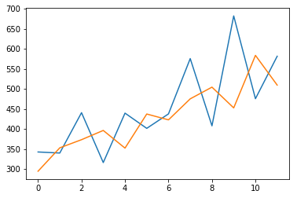


## Seasonal Persistence Forecasting

It is critical to have a useful first-cut forecast on time series problems to provide a lower-bound on skill before moving on to more sophisticated methods.

This is to ensure we are not wasting time on models or datasets that are not predictive.

It is common to use a persistence or a naive forecast as a first-cut forecast model when time series forecasting.

This does not make sense with time series data that has an obvious seasonal component. A better first cut model for seasonal data is to use the observation at the same time in the previous seasonal cycle as the prediction.

We can call this **seasonal persistence** and it is a simple model that can result in an effective first cut model.

One step better is to use a simple function of the last few observations at the same time in previous seasonal cycles. For example, the mean of the observations. This can often provide a small additional benefit.

In this tutorial, we will demonstrate this simple seasonal persistence forecasting method for providing a lower bound on forecast skill on three different real-world time series datasets.

### Seasonal Persistence with Sliding Window

In this tutorial, we will use a sliding window seasonal persistence model to make forecasts.

Within a sliding window, observations at the same time (such as same day, same month, etc.) in previous one-year seasons will be collected and the mean of those observations can be used as the persisted forecast (for the same day, month, etc.).

Different window sizes (e.g., same day of the year over the last window=5 years) can be evaluated to find a combination that minimizes error.

As an example, if the data is monthly and the month to be predicted is February, then with a window of size 1 (w=1) the observation last February will be used to make the forecast.

A window of size 2 (w=2) would involve taking observations for the last two Februaries to be averaged and used as a forecast.

An alternate interpretation might seek to use point observations from prior years (e.g. t-12, t-24, etc. for monthly data) rather than taking the mean of the cumulative point observations. Perhaps try both methods on your dataset and see what works best as a good starting point model.


### Experimental Test Harness

It is important to evaluate time series forecasting models consistently.

In this section, we will define how we will evaluate forecast models in this tutorial.

First, we will hold the last two years of data back and evaluate forecasts on this data. This works for both monthly and daily data we will look at.

We will use a **walk-forward validation** to evaluate model performance. This means that each time step in the test dataset will be enumerated, a model constructed on historical data, and the forecast compared to the expected value. The observation will then be added to the training dataset and the process repeated.

Walk-forward validation is a realistic way to evaluate time series forecast models as one would expect models to be updated as new observations are made available.

Finally, forecasts will be evaluated using root mean squared error, or RMSE. The benefit of RMSE is that it penalizes large errors and the scores are in the same units as the forecast values (car sales per month).

In summary, the test harness involves:

- The last 2 years of data used as a test set.
- Walk-forward validation for model evaluation.
- Root mean squared error used to report model skill.


```python
from pandas import Series
from sklearn.metrics import mean_squared_error
from math import sqrt
from numpy import mean
from matplotlib import pyplot

filename1 = 'max-daily-temps.csv'
filename2 = 'writing-paper-sales.csv'

# load data
series1 = read_csv(filename1, header=0, engine='python', skipfooter=2)
series2 = read_csv(filename2, header=0, engine='python', skipfooter=2)

# prepare data
X1 = series1.values
X1 = X1[:, 1]
print("5 samples of X1:", X1[0:5])

X2 = series2.values
X2 = X2[:, 1]
# print("5 samples of X2:\n", X2[0:5])
print('5 samples of X2: {d[0]:.2f}  {d[1]:.2f}  {d[2]:.2f}  {d[3]:.2f}  {d[4]:.2f}'.format(d = X2[0:5]))

          
period1 = 365     # to collect observations on each day in a year over the last 8 years
period2 = 12      # to collect observations in each month in a year over the last 10 years

years_test = 2   # number of years reserved for test

# evaluate mean of different number of years
years1 = [1, 2, 3, 4, 5, 6, 7, 8]      # look back 1, 2,..., 8 years. The last two years, 9 and 10, are reserved for test
years2 = [1, 2, 3, 4, 5, 6, 7, 8, 9, 10] 

X = X2
years = years2
period = period2

train, test = X[0:-(years_test*period)], X[-(years_test*period):]

scores = list()

for year in years:
    # walk-forward validation
    # history = [x for x in train]
    history = list(train)
    predictions = list()
    for i in range(len(test)):   # for every day in test set, we need to get its historic average
        # collect observations (i.e., obs)
        obs = []    #list()
        for y in range(1, year+1):
            obs.append(history[-(y*period)+i])
        # make prediction
        yhat = mean(obs)
        predictions.append(yhat)
        # observation
        history.append(test[i])
    # report performance
    rmse = sqrt(mean_squared_error(test, predictions))
    scores.append(rmse)
    print('Years=%d, RMSE: %.3f' % (year, rmse))
pyplot.plot(years, scores)
pyplot.show()
```

    5 samples of X1: [38.1 32.4 34.5 20.7 21.5]
    5 samples of X2: 1359.80  1278.56  1508.33  1419.71  1440.51
    Years=1, RMSE: 823.534
    Years=2, RMSE: 756.109
    Years=3, RMSE: 779.634
    Years=4, RMSE: 799.158
    Years=5, RMSE: 806.667
    Years=6, RMSE: 814.453
    Years=7, RMSE: 827.889
    Years=8, RMSE: 839.553
    Years=9, RMSE: 850.114
    Years=10, RMSE: 863.323
    


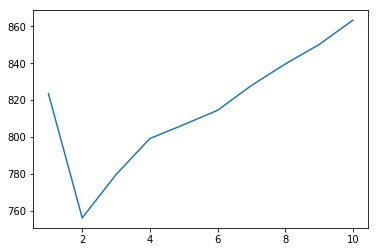


```python

```
